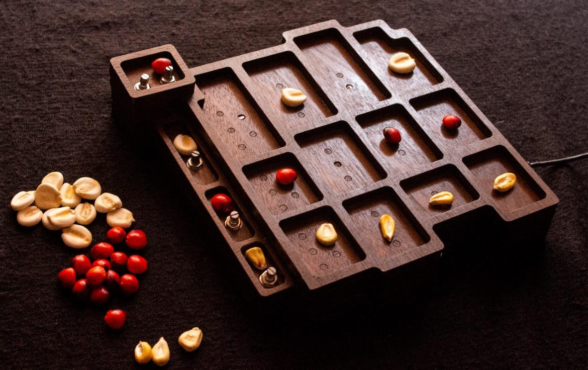

# Kanchay_Yupana_

The **Kanchay_Yupana//** is a NIME created to generate musical rhythms. This instrument is inspired by an Andean device called the *Yupana*. The *Yupana* is a physical board, similar to an abacus, made in different sizes and materials. It has a series of carved geometric slots where seeds or pebbles are placed to perform arithmetic calculations, a practice used since pre-colonial times.  

The ancient instruments *Yupana* is strictly related to antoher device, the *Khipu*:  
>"In ancient times, the khipu and the yupana were technologies that complemented each other and were used together. The numerical values that resulted from the calculation in the yupana were stored and codified in the knots of the khipus of numerical character.   Some experts identify the yupana as a memory ram and the khipu as the hard disk of a computer that needs the body and mind to compute” (Cadavid, 2022).  
 
**Kanchay_Yupana//** complement the **Electronic_Khipu_** like the ancient instruments. Indeed, the **Kanchay_Yupana//** is built to create patterns that can be transformed into rhythms and other sonorities, completing the live performance created with the **Electronic_Khipu_**.  

https://www.patriciacadavid.net/search/label/kanchay_yupana 



## Technical notes 

The **Kanchay_Yupana//** consists of a wooden board with 16 cavities. The cavities (arranged in four rows and four columns) hold digital LDR modules, and four of them (arranged in a single column) have installed potentiometers. A Teensy 2.0 microcontroller manages the whole system. The digital LDR modules use photoresistors to measure light intensity, outputting either "low" when there is no light or "high" when there is light. The detection threshold can be adjusted with a potentiometer.  
This instrument works like a sequencer. Each row represents an instrument, and each column represents a beat (each instrument has four beats). By placing a seed in one of the indentations to cover a sensor, the instrument in that row will be triggered on the beat indicated by the column of that indentation.

## Instruction
[Go to the instructions for building the Kanchay_Yupana//.](documentation/instructions/README.md)

## Acknowledgment
This project has been supported by Cultura Resident, an artistic residency program of the Consorci de Museus de la Comunitat Valenciana in partnership with the Cultural Center of Spain in Santiago Chile.   
**Special thanks to**: Natasha Pons and all the team of the CCESantiago

## Cite Repository
```text
@software{
    Cadavid_Kanchay_Yupana,
    author = {Cadavid, Patricia},
    license = {GPL-3.0},
    title = {{Kanchay\_Yupana\_}},
    url = {https://github.com/lpatriciacadavid/Kanchay_Yupana_}
}
```

```text
Cadavid, P. Kanchay_Yupana_ [Computer software]. https://github.com/lpatriciacadavid/Kanchay_Yupana_
```

See [Documentation](documentation) for related articles
