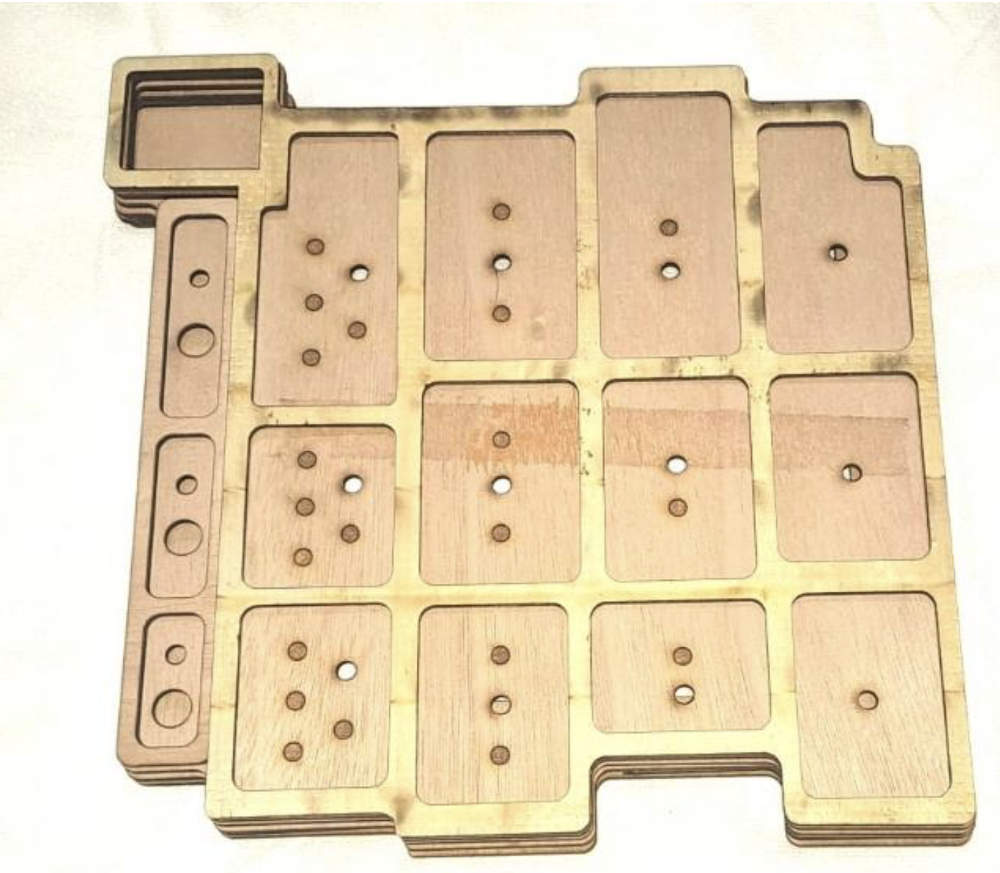
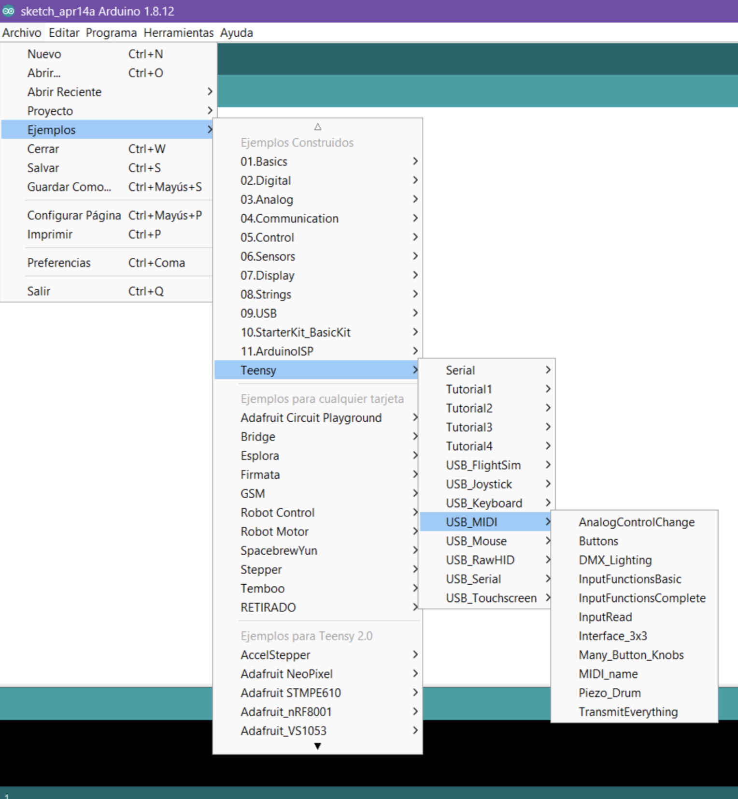
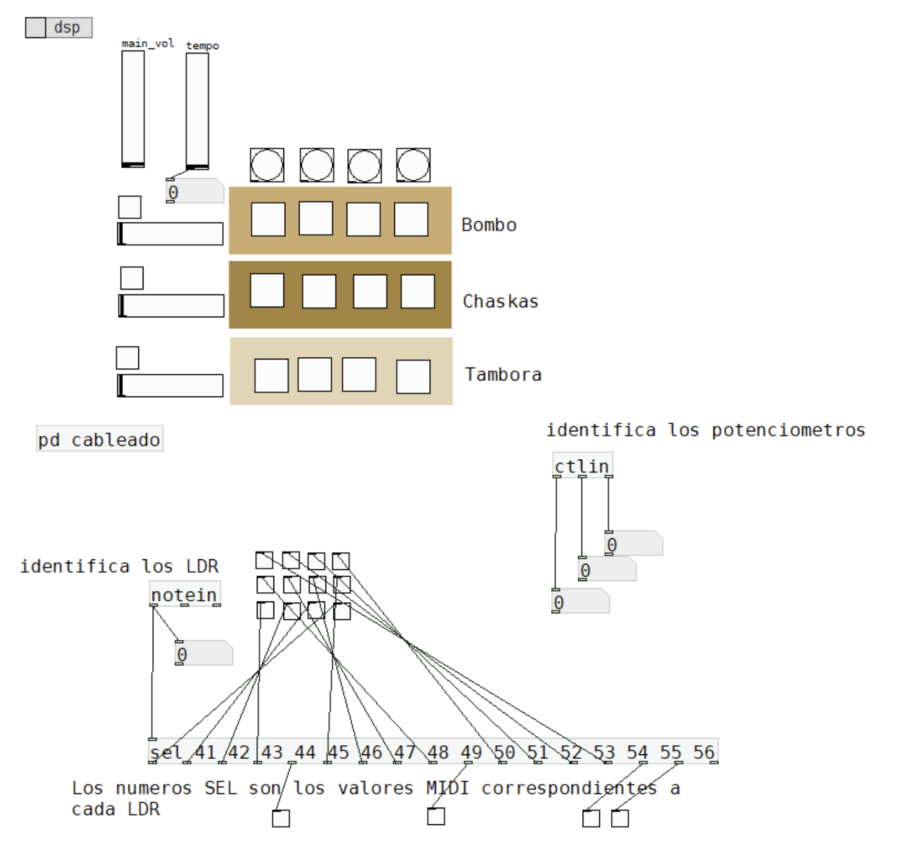
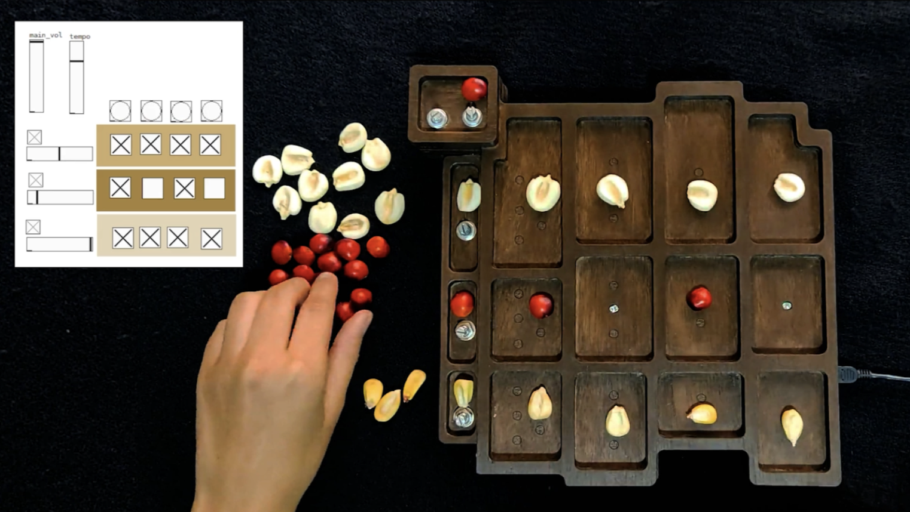

# Instructions

## Developing Instructions

### Box
The structure of the yupana is inspired by the ancient stone yupanas. To make it, I created cardboard models to see which one worked best, always with the traditional structure of 4 squares (see [https://youtu.be/zj3Y-BGvhj4](https://youtu.be/zj3Y-BGvhj4)).

In order to build it to size, I made it with a sort of layered wooden structure (like a sandwich) so that each layer could be laser-cut, allowing me to place all the wiring and components inside.

  
  

One of the layers is perforated so that the photoresistors can be shown in each of the drawers, and there is a back cover to easily replace any damaged components. Once it was cut and assembled, I painted it in dark tones to make it stand out against the color of the seeds.

### Electronic components

The yupana primarily uses **photoresistors** to detect light and shadow, converting this into digital signals sent to the microcontroller. These work like buttons, turning on or off, and in Pure Data, activate or deactivate pre-recorded sounds in MIDI.

The photoresistors I use are pre-built digital modules with their own resistor and mini potentiometer to set the threshold. I chose them because it's simpler than mapping each LDR individually through programming.  
I use these modules: [Aokin Light Dependent Resistor (LDR) Sensor Module](../components/Aokin_Light_Dependent_Resistor_(LDR)_Sensor_Module.pdf)

The **Kanchay Yupana** includes:
- **16 digital LDR modules** (active in shadow, inactive in light):
  - **12 LDRs**: each functions as a trigger for the instrument in each row of boxes.
  - **3 LDRs**: act as on-off switches for each row.
  - **1 LDR**: serves as the instrument's main switch.

Additional controls include **10k potentiometers**:
- **5 potentiometers**:
  - **3** for adjusting the volume of each row (instrument).
  - **1** for overall volume.
  - **1** for setting the general tempo.

### Microcontroller

I used the **Teensy 2.0 microcontroller** ([Teensy 2.0](https://www.pjrc.com/store/teensy.html)) because it’s compact, affordable, and has enough digital and analogue pins without needing extra solutions. It’s also easy to program as an external MIDI controller.

### Wiring
The wiring for each component is done with Dupont connectors to allow for easy replacement in case of damage. For this reason, everything is not connected in a single line, as that would make repairs more cumbersome.

<i>This is the first sketch of the instrument's internal wiring (in this image, the ground and 5V wiring for each LDR module is missing, as well as the wiring for the potentiometers).</i>

It includes two rows of female Dupont headers connected to ground and 5V, respectively, to power all the components.

  
  

### Programming

For programming the Teensy, I used the `USB_MIDI` examples provided by Teensyduino, which can be found here: [Teensyduino Download](https://www.pjrc.com/teensy/td_download.html) (it uses the Arduino IDE). These examples were adapted for the LDRs and potentiometers as buttons.

The sketches are available in the repository. [Arduino Sketch](../../code/teensyduino_02-kanchay_yupana)  
Once the Teensy is programmed, Pure Data recognizes the Yupana as a MIDI controller.

#### Notes for Working with Pure Data

I use **PD EXTENDED**: [https://puredata.info/downloads/pd-extended](https://puredata.info/downloads/pd-extended)

To connect the Yupana as a MIDI controller:
1. Go to **Media** – **MIDI Settings**.
2. Select **Teensy** as the input device.
3. Click **Apply**.

The patch for the **Kanchay//Yupana** is based on Jonathan Carrasco's tutorial: [https://youtu.be/P6E2o0ALMAI](https://youtu.be/P6E2o0ALMAI).

[Pure data project](../../code/puredata-kanchay_yupana)

- I use the **notein** object to identify MIDI numbers when any shadow is detected on the LDRs.
- The **ctlin** object is used to identify potentiometer values.

Place the instrument samples in the same folder as the patch, ensuring they:
- Have lowercase names,
- No spaces,
- And are in **.wav** format.

## Performance notes
In ancient yupanas, small stones and seeds were used for interaction.

In the **Kanchay//Yupana**, I use **corn seeds** and **huairuro seeds** native to the Andean region. Their role is a tribute to the original device, but you can interact with the instrument using any objects that simply cover and uncover the LDR sensors.

